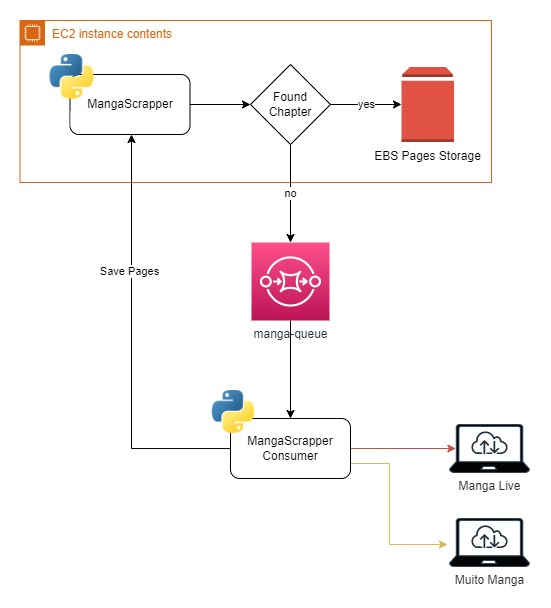

# Manga Page Scraper

<p align="center">
    
    <br />
    <br />
    <a href="https://github.com/jjeanjacques10/manga-scrapper-api/issues">Report Bug</a>
    ·
    <a href="https://github.com/jjeanjacques10/manga-scrapper-api/issues">Request Feature</a>
</p>

This is a simple script to scrape manga pages from a websites and save them to a folder on AWS EC2 instance. There is an api and a consumer, the api is a Flask app that takes a chapter from a manga and if not already scraped, send a message to the consumer SQS to scrape the pages.

## SQS Queue

SQS Message

``` json
{
    "source": "manga_livre",
    "manga": "Naruto",
    "chapter": "692"
}
```

## Endpoints

```http
  GET /page
```

| Query Param   | Type       | Description                           |
| :---------- | :--------- | :---------------------------------- |
| `source` | `string` | **Required**. manga_livre or muito_manga |
| `manga` | `string` | **Required**. manga name |
| `number` | `string` | **Required**. chapter number |
| `page` | `string` | **Required**. page number |

```http
  POST /page
```

| Form   | Type       | Description                           |
| :---------- | :--------- | :---------------------------------- |
| `source` | `string` | **Required**. manga_livre or muito_manga |
| `manga` | `string` | **Required**. manga name |
| `number` | `string` | **Required**. chapter number |
| `page` | `string` | **Required**. number of pages |
| `image` | `file` | **Required**. image file |

```http
  GET /chapter
```

| Query Param   | Type       | Description                           |
| :---------- | :--------- | :---------------------------------- |
| `source` | `string` | **Required**. manga_livre or muito_manga |
| `manga` | `string` | **Required**. manga name |
| `number` | `string` | **Required**. chapter number |

## Sites Supported

- [Manga Livre](https://mangalivre.net/)
- [Muito Manga](https://muitomanga.com/)

## Architecture



## Licença

[MIT](https://choosealicense.com/licenses/mit/)

---
Developed by [Jean Jacques Barros](https://github.com/jeanjacques10)
